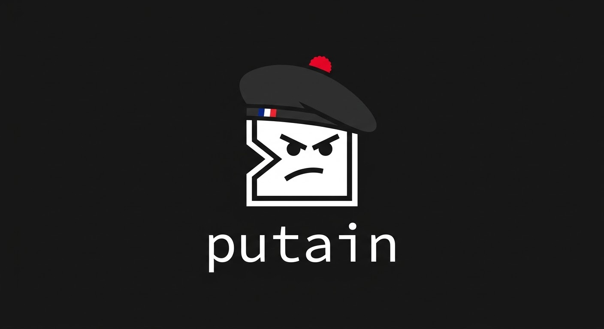

<p align="center">
  
</p>

<p align="center">
  <a href="https://github.com/tobiasdotrip/putain/actions/workflows/ci.yml"></a>
  <a href="https://github.com/tobiasdotrip/putain/blob/main/LICENSE"></a>
  
  
  <a href="https://github.com/tobiasdotrip/putain"></a>
</p>

A fast, funny French shell command corrector. Like [thefuck](https://github.com/nvbn/thefuck), but en français.

```
$ gti status
zsh: command not found: gti

$ putain
Putain...
→ git status
Exécuter ? [O/n]
```

## Installation

### From source (Cargo)

```bash
cargo install --path .
```

### Shell hook (recommended)

The hook auto-detects failed commands and triggers `putain` automatically.

**zsh** — add to `~/.zshrc`:
```bash
eval "$(putain --hook zsh)"
```

**bash** — add to `~/.bashrc`:
```bash
eval "$(putain --hook bash)"
```

**fish** — add to `~/.config/fish/config.fish`:
```bash
putain --hook fish | source
```

## Usage

```bash
# Manual mode: run after a failed command
putain

# Auto-execute without confirmation
putain -y

# Generate hook script
putain --hook zsh
```

## Built-in rules

| Rule | Trigger | Fix |
|------|---------|-----|
| `sudo` | Permission denied | Prepends `sudo` |
| `git_push_upstream` | No upstream branch | `git push --set-upstream origin <branch>` |
| `git_checkout_new_branch` | Pathspec not found | `git checkout -b <branch>` |
| `typo_command` | Command not found | Fuzzy match against known commands + PATH |
| `cd_typo` | No such directory | Fuzzy match against sibling dirs |

## TOML plugins

Create `.toml` files in `~/.config/putain/plugins/`:

```toml
[[rule]]
name = "npm_typo"
command = "npm"
output_pattern = "Did you mean (.+)\\?"
fix = "npm {1}"
```

### Template variables

| Variable | Value |
|----------|-------|
| `{1}`, `{2}`, ... | Regex capture groups from `output_pattern` |
| `{command}` | The original failed command |
| `{last_arg}` | Last whitespace-separated token of the command |
| `{current_branch}` | Current git branch |

### Shipped plugins

- `plugins/git.toml` — git add, stash, pull fixes
- `plugins/permissions.toml` — permission denied catch-all
- `plugins/docker.toml` — Docker daemon / permission fixes

## Personality

`putain` escalates its reactions the more you repeat the same mistake:

1. *"Putain..."*
2. *"Oh putain, encore ?!"*
3. *"PUTAIN MAIS C'EST PAS POSSIBLE"*
4. *"... (soupir) ..."*

## License

MIT
